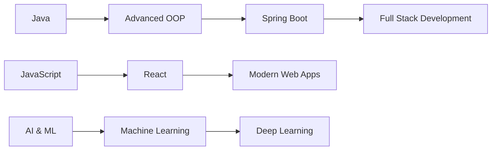

<p align="center">
  
</p>

<h3 align="center">
  
</h3>

<p align="center">
  <a href="https://www.linkedin.com/in/nimuthu-pathirathne-6853a9365">
    
  </a>
</p>

---

# 🚀 About Me

```yaml
Name: Nimuthu Pathirathne
Role: Computer Science Undergraduate

Interests:
  - Software Engineering
  - Full-Stack Development
  - Artificial Intelligence
  - Machine Learning
  - Open Source

Currently Learning:
  - Advanced Java
  - JavaScript
  - AI & Machine Learning
  - Modern Web Development

Goal:
  - Become a Professional Software Engineer
```

---

# 💻 Tech Stack

<p align="center">
  
</p>

---

# 📚 Learning Progress

```text
Java            █████████░ 90%
JavaScript      ████████░░ 80%
HTML            ██████████ 95%
CSS             ██████████ 95%
Git & GitHub    ████████░░ 80%
AI / ML         ██████░░░░ 60%
React           █████░░░░░ 50%
```

---

# 📊 GitHub Statistics

<p align="center">
  
  
</p>

<p align="center">
  
</p>

---

# 📈 Contribution Activity

<p align="center">
  
</p>

---

# 🏆 GitHub Trophies

<p align="center">
  
</p>

---

# 🎯 Current Roadmap



---

# 🚀 Featured Goals for 2026

- Build Full-Stack Projects
- Learn Spring Boot
- Master Git & GitHub
- Explore Deep Learning
- Contribute to Open Source
- Improve Data Structures & Algorithms

---

# 💭 Developer Quote


---

# ⚡ Fun Facts

- 💻 I enjoy building software and web applications
- 🤖 Interested in Artificial Intelligence and Machine Learning
- ☕ Java is one of my favorite technologies
- 🌱 I believe in continuous learning
- 🚀 Always working on improving my skills

---

# 🌐 Connect With Me

<p align="center">
  <a href="https://www.linkedin.com/in/nimuthu-pathirathne-6853a9365">
    
  </a>
</p>

<p align="center">
📧 nimuthu.rp@gmail.com
</p>

---

# 👀 Profile Visitors

<p align="center">
  
</p>

---

<p align="center">
✨ Building skills today for the technology of tomorrow ✨
</p>
